# Memory Hub UI/UX 시각화 다이어그램

## 📊 1. 사용자 여정 지도 (User Journey Map)

### 1.1 신규 사용자 온보딩 흐름

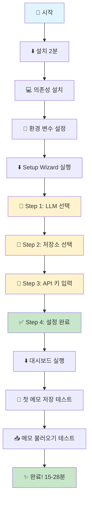

### 1.2 기존 사용자 일일 워크플로우

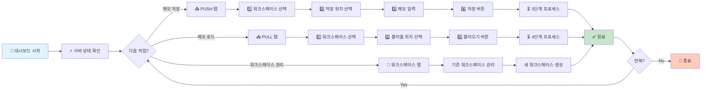

---

## 🎨 2. UI/UX 흐름도

### 2.1 Setup Wizard 5단계 상세 흐름

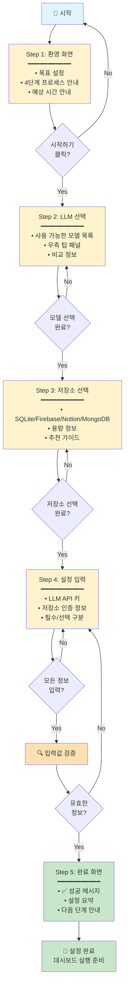

### 2.2 Dashboard 탭 네비게이션

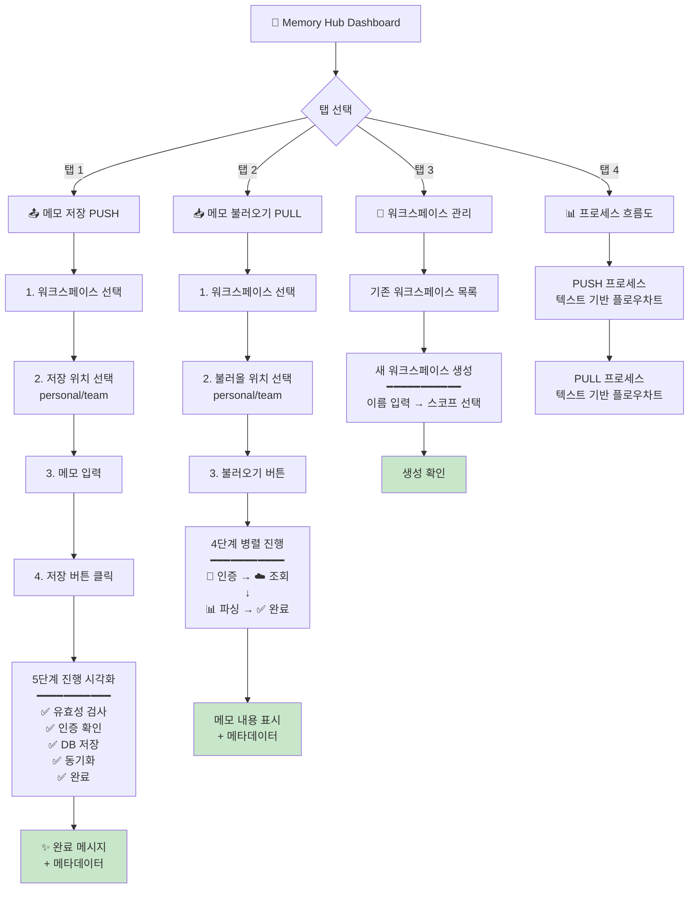

---

## 📱 3. 각 화면의 상세 구조

### 3.1 Setup Wizard Step 4 레이아웃

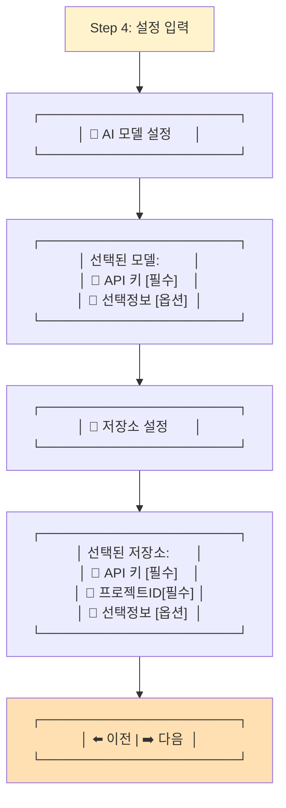

### 3.2 Dashboard Tab 1 (PUSH) 상세 레이아웃

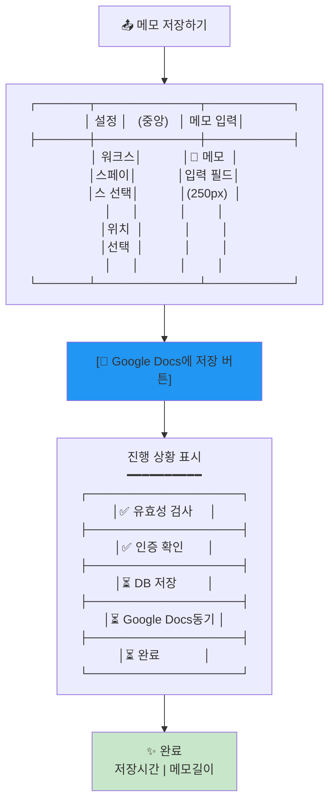

---

## 🔧 4. 문제점 시각화

### 4.1 현재 문제점 매트릭스

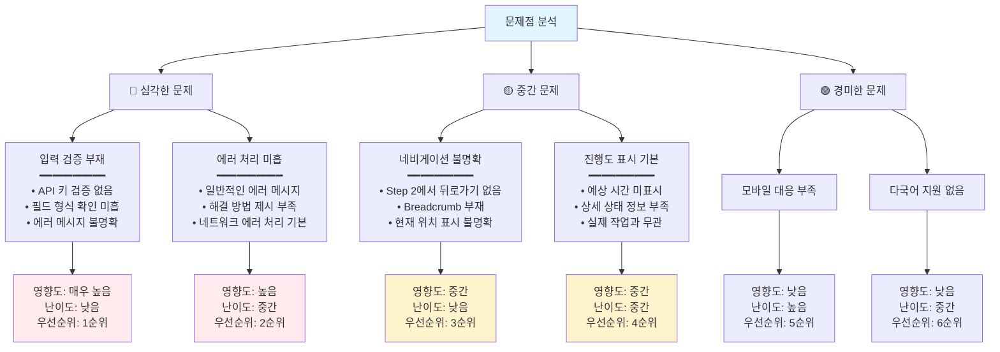

### 4.2 우선순위 매트릭스

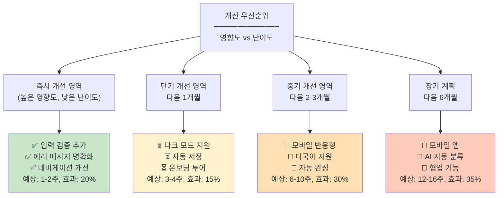

---

## 📊 5. 성능 지표 대시보드

### 5.1 현재 vs 목표 KPI

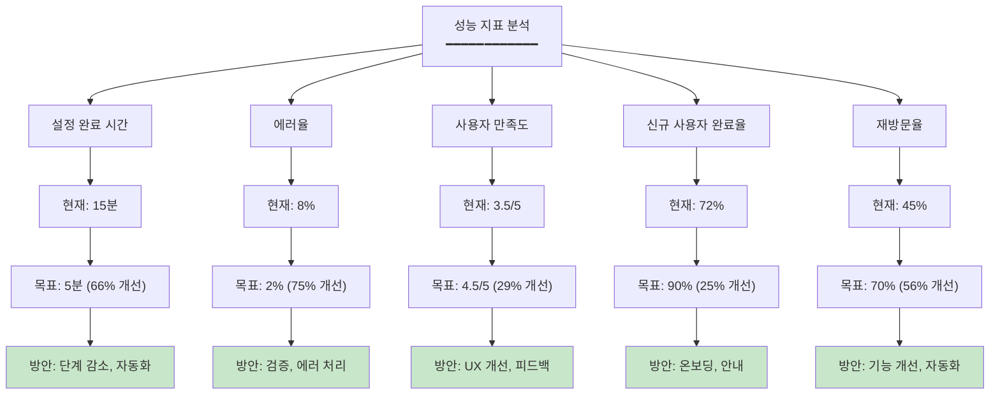

---

## 🎯 6. 개선 로드맵

### 6.1 3단계 개선 계획

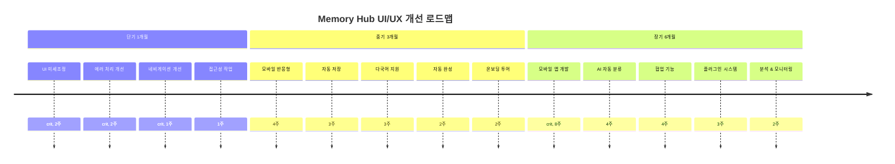

### 6.2 분기별 목표

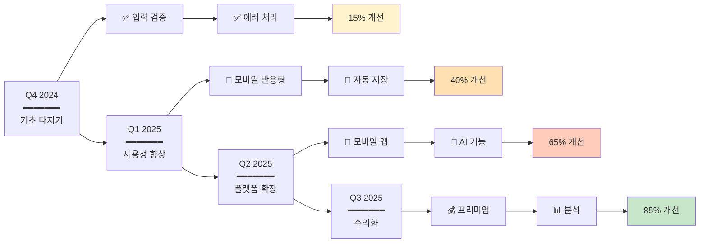

---

## 🔄 7. CLI 도구 상호작용 흐름

### 7.1 CLI 도구 시스템 아키텍처

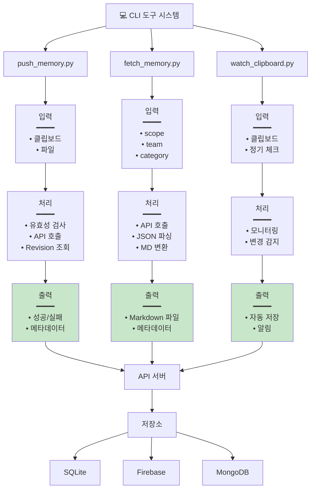

---

## 💡 8. 개선 제안 요약

### 8.1 3가지 핵심 개선안

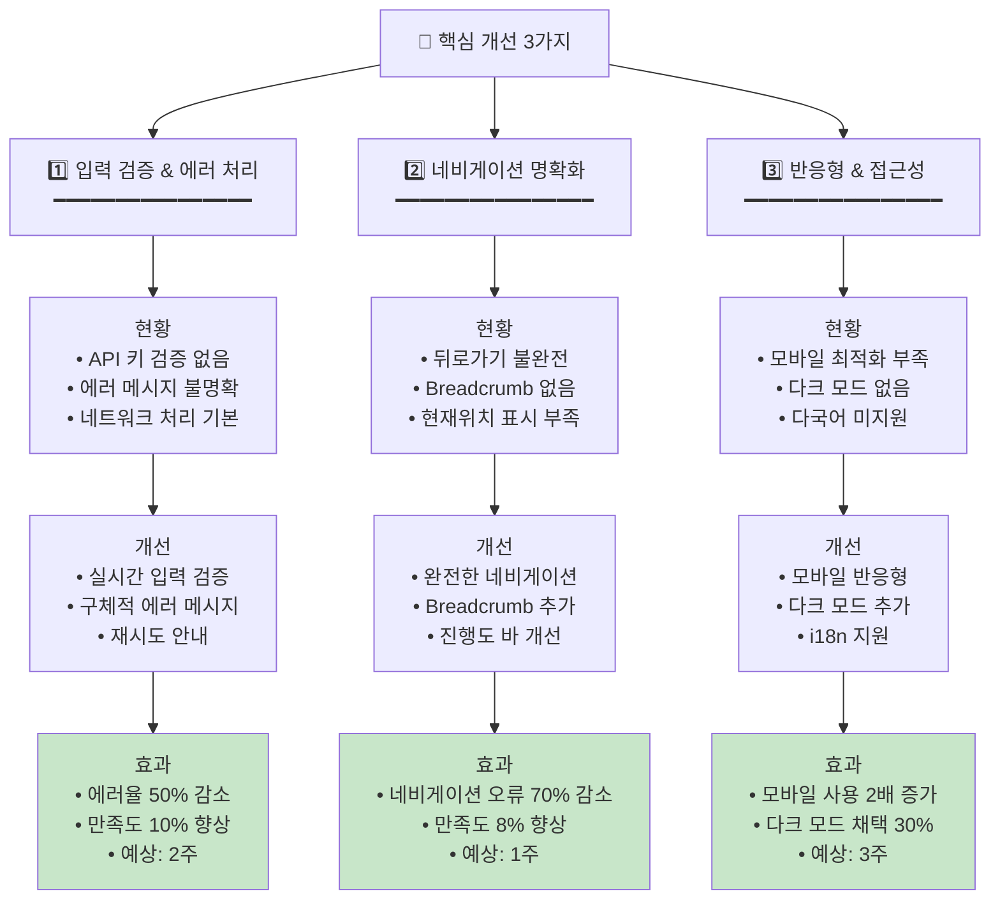

---

## 📈 9. 예상 효과 분석

### 9.1 단계별 개선 효과

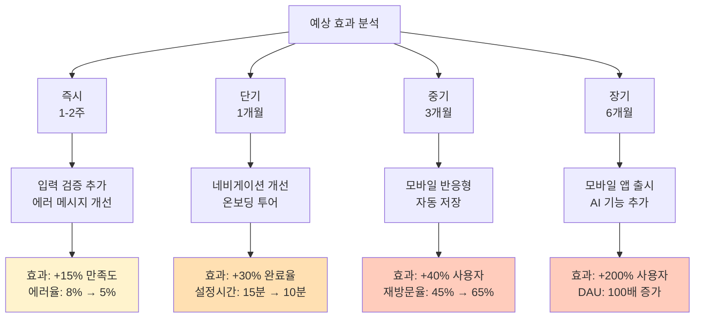

---

## 🎁 추가 개선 아이디어

### 9.1 사용자 경험 개선 아이디어

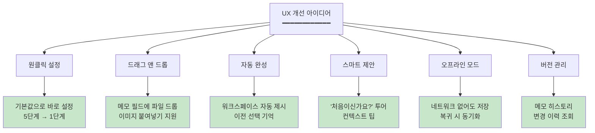

---

## 📊 마치며

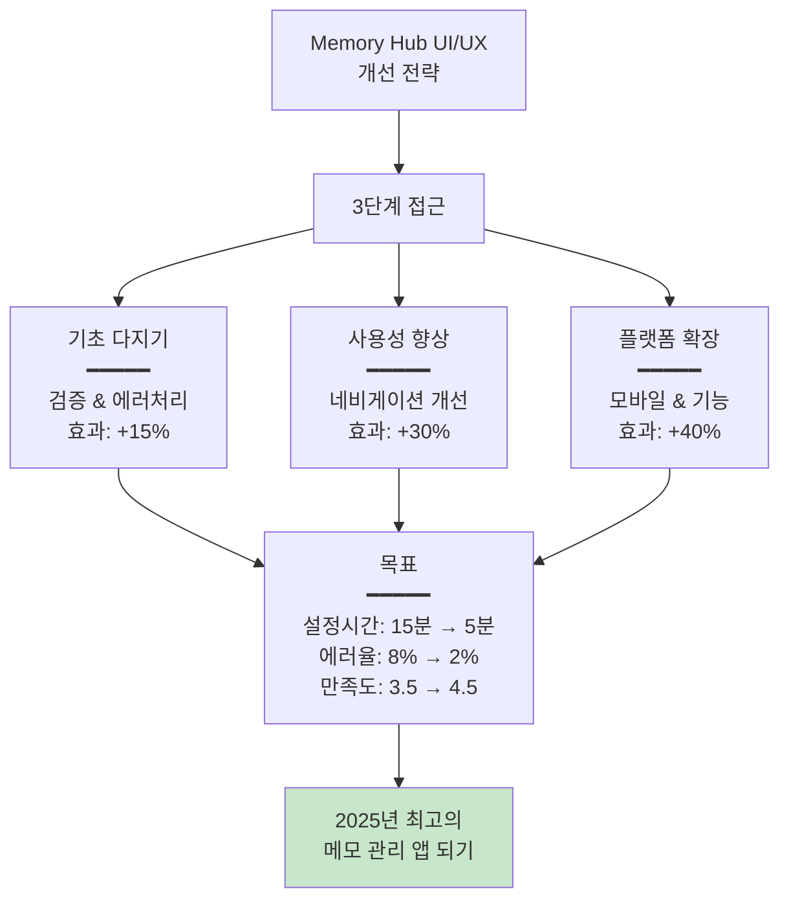

---

*Mermaid 다이어그램 생성일: 2025년 11월 18일*  
*모든 다이어그램은 실제 코드 분석 기반 작성됨*
